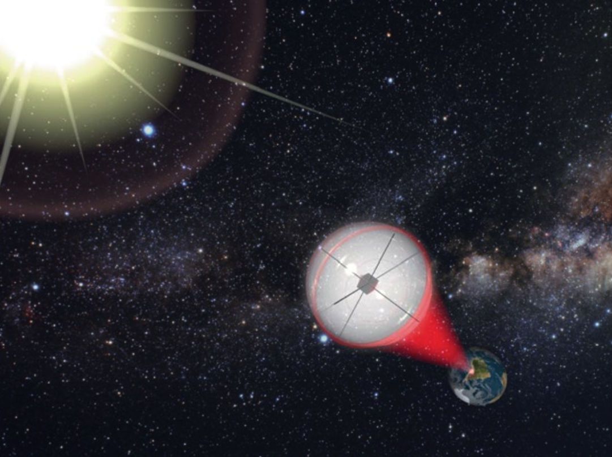

# Starshot

A Python library for the Starshot initiative.


* Credit: Atwater et al. (2018)

## Description

The Breakthrough Starshot Initiative aims to accelerate an ultralight spacecraft to 20% of the speed of light, reaching Proxima Centauri in approximately 20 years. The spacecraft would consist of a low-density ‘lightsail’ and a payload which contains the electronics responsible for transmitting data back to Earth (Atwater et al. 2018). The lightsail would be remotely propelled by radiation pressure, using an Earth-based laser array operating in the near-infrared spectral range.

## Assumptions

* Flat, circular lightsail
* Mass of payload is equal to the mass of the lightsail; the optimal mass condition ([Kulkarni 2018](https://iopscience.iop.org/article/10.3847/1538-3881/aaafd2))
* Circular laser array emits a Gaussian beam
* Beam is focused so that the beam waist tracks the lightsail, and the beam waist is as small as diffraction allows
* Beam strikes and reflects off lightsail orthogonally
* Sail instantaneously reaches equilibrium temperature at every point of its journey
* Heat transfer between layers of multilayer sail is instantaneous
* For hemispherical emissivity calculations, since it is not possible to integrate spectral emissivity over all wavelengths (interval [0,inf)), it is instead calculated only over a 1-25 micrometre range by default. A different range can be defined by user input.
* Special relativity is taken into account

## Installation

* Clone this repo to your local machine using [https://github.com/anly2178/Starshot.git](https://github.com/anly2178/Starshot.git)
* Install the Python modules:
  * [dill](https://pypi.org/project/dill/)
  * [scipy](https://pypi.org/project/scipy/)
  * [numpy](https://pypi.org/project/numpy/)
  * [matplotlib](https://pypi.org/project/matplotlib/)

### Setup

The directory tree should appear like this:

```bash
root
├── test.py
├── saved_materials
└── Starshot
    ├── README.md
    ├── __pycache__
    ├── __init__.py
    ├── sail.py
    ├── multilayer_sail.py
    ├── diffractive_sail.py
    ├── motion.py
    ├── gaussbeam.py
    ├── results.py
    ├── gaussbeam.py
    ├── motion.py
    ├── images
    ├── materials
    │   ├── README.txt
    │   ├── __pycache__
    │   ├── material.py
    │   ├── save_load_mat.py
    │   └── interpolator.py
    ├── tmm
    │   ├── __pycache__
    │   ├── tmm.py
    │   └── make_transfer_matrix.py
    └── testfiles
        ├── material_tests
        │   ├── README.md
        │   ├── init_germania.py
        │   ├── init_silica.py
        │   ├── init_gap.py
        │   ├── init_alumina.py
        │   ├── n_germania.txt
        │   ├── k_germania.txt
        │   ├── n_sio2_kkg.py
        │   ├── k_sio2_kkg.py
        │   ├── n_gap.txt
        │   ├── k_gap.txt
        │   ├── n_alumina.txt
        │   └── k_alumina.txt
        └── sail_tests
            ├── README.md
            ├── simple_test.py
            ├── multi_test.py
            └── find_power_test.py

```
* Starshot directory is downloaded from github.

* test.py is to be created by the user. It is the script that the user runs.
The user may name the script something else. It is important that the script
is located parallel to the Starshot directory.

* saved_materials is automatically created when the user initialises a Material object.

* testfiles directory contains commented tests/examples for the user.
  * The user should duplicate the files in material_tests and sail_tests inside the root directory. Read the READMEs in the testfile directories for more detail.

## Usage

**To initialise a new** ```Material```:

```python
from Starshot.materials.material import Material

new_material = Material(name=insert_name, density=insert_density, max_temp=insert_max_temp,
  abs_coeff=insert_abs_coeff, n_list_path=insert_n_list_path, k_list_path=insert_k_list_path)
```
* For more detail, see the Material section.

**To initialise a new** ```Sail```:

```python
from Starshot.sail import Sail

new_sail = Sail(name=insert_name, mass=insert_mass, area=insert_area, reflectance=insert_reflectance,
  target=insert_target, power=insert_power, wavelength=insert_wavelength)
```
* For more detail, see the Sail section.

**To initialise a new** ```MultilayerSail```:

```python
from Starshot.multilayer_sail import MultilayerSail

new_multi = MultilayerSail(name=insert_name, materials=insert_materials, mass=insert_mass,
  thickness=insert_thickness, area=insert_area, target=insert_target,
  max_Starchip_temp=insert_max_temp, power=insert_power, wavelength=insert_wavelength)
```
* For more detail, see the Multilayer Sail section.

**To calculate mission scenario**:

```python
sail_name.calculate_mission()
```
* Calculates the mission scenario, including distance, speed and time, using the differential equation given by [Kulkarni et al. (2018)](https://iopscience.iop.org/article/10.3847/1538-3881/aaafd2), solved using Runge-Kutta method.
* A folder is created with 2 txt files and 1 png file. ```trajectory.txt``` file includes distance, speed and time results. ```variables.txt``` file includes the variables of the mission. ```plots.png``` file includes speed vs distance and speed vs time graphs.

*Note*: Although there is a file for ```DiffractiveSail``` subclass, it has not been implemented yet.

## Sail

The ```Sail``` class is the superclass for all subclasses of sails, such as ```MultilayerSail``` and ```DiffractiveSail```. Therefore, these subclasses inherit the ```Sail``` attributes and methods.

### Attributes

* *name* (str) - a unique name or code that identifies the sail. Defaults to None.
* *mass* (float) [kg] - mass of lightsail (*excluding payload*). It is assumed that payload mass equals to lightsail mass as per optimal mass condition ([Kulkarni 2018](https://iopscience.iop.org/article/10.3847/1538-3881/aaafd2)). Defaults to None.
* *area* (float) [m^2] - surface area of lightsail on one side. Defaults to None.
* *radius* (float) [m] - radius of lightsail.
* *s_density* (float) [kg/m^2] - surface density of lightsail.
* *reflectance* (float) - fraction of incident power that is reflected by lighsail.
* *transmittace* (float) - fraction of incident power that is transmitted through lightsail.
* *target* (float) - target speed as fraction of speed of light. Defaults to 0.2c.
* *power* (float) [W] - power of laser array. Defaults to None.
* *wavelength* (float) [m] - laser wavelength, not Doppler-shifted. Defaults to 1.064e-6 m.
* *W* (float) [sqrt(g)/m] - square root of 'reflectivity-adjusted-area-density' as defined by [Ilic et al. (2018)](https://pubs.acs.org/doi/10.1021/acs.nanolett.8b02035).
* *diameter* (float) [m] - diameter of circular laser array.
* *angles_coeffs* (list of tuples of three floats) - angle [degrees], reflection efficiency and transmission efficiency of each order. Created to make calculations more efficient for diffractive sails (when they are implemented.)

| Attribute | Type | From | Required? |
| --------- | ---- | ---- | --------- |
| name | str | User input | Yes |
| mass | float | User input | Yes |
| area | float | User input | Yes |
| radius | float | Calculated | No |
| s_density | float | Calculated | No |
| reflectance | float | User input or calculated | Yes, if cannot be calculated, e.g. with transfer-matrix method |
| transmittance | float | Calculated | No |
| target | float | User input | Yes, but defaults to 0.2c if not given |
| power | float | User input | Yes |
| wavelength | float | User input | Yes |
| W | float | Calculated | No |
| diameter | float | Calculated | No |
| angles_coeffs | list of tuples of three floats | Calculated | No |

### Methods

```python
__init__(   self, name=None, mass=None, area=None, reflectance=None,
                  target=0.2, power=None, wavelength=1.064e-6)
```
* Constructor for ```Sail``` class

```python
calculate_mission()
```
* Calculates the mission scenario, including distance, speed and time.
* A folder is created with 2 txt files and 1 png file. ```trajectory.txt``` file includes distance, speed and time results. ```variables.txt``` file includes the variables of the mission. ```plots.png``` file includes speed vs distance and speed vs time graphs.

## Multilayer Sail

The ```MultilayerSail``` class is a subclass of ```Sail```. It includes sails with 1 or more layered materials.

### Attributes

* *materials* (list of str) - list of strings representing the materials in each layer, starting from the layer closest to the laser array. The tag for each material is its chemical formula, or as defined by the user.
* *thickness* (list of floats) [m] - list of the thicknesses of each layer, starting from the layer closest to the laser array.
* *absorptance* (float) - fraction of incident power absorbed by lightsail.
* *max_Starchip_temp* (float) [K] - maximum temperature the payload can have. Defaults to 1000 K.
* *temp_reached* (float) [K] - maximum temperature reached on the journey. If power is given, temp_reached is calculated by equating power absorbed and emitted. If power is not given, temp_reached is equal to the minimum of [max_Starchip_temp and materials' max_temp].

*Note*: The ```MultilayerSail``` class inherits the attributes of the ```Sail``` class.

| Attribute | Type | From | Required? |
| --------- | ---- | ---- | --------- |
| name | str | User input | Yes |
| mass | float | User input or calculated | At least one of either mass or area |
| area | float | User input or calculated | At leat one of either mass or area |
| radius | float | Calculated | No |
| s_density | float | Calculated | No |
| reflectance | float | Calculated | No |
| transmittance | float | Calculated | No |
| target | float | User input | Yes, but defaults to 0.2c if not given |
| power | float | User input or calculated | No, a max power can be calculated from max temps |
| wavelength | float | User input | Yes, but defaults to 1064 nm |
| W | float | Calculated | No |
| diameter | float | Calculated | No |
| angles_coeffs | list of tuples of three floats | Calculated | No |
| materials | list of str | User input | Yes |
| thickness | list of floats | User input | Yes |
| absorptance | float | Calculated | No |
| max_Starchip_temp | float | User input | No, defaults to 1000 K |
| temp_reached | float | Calculated | No |

### Methods

```python
__init__(   self, name=None, materials=None, mass=None, thickness=None,
                  abs_coeff=None, target=0.2, max_Starchip_temp=1000, power=None, wavelength=1.064e-6)
```

* Constructor for  ```MultilayerSail``` class.

```python
calculate_mission()
```

* Inherited from ```Sail``` class.  

### Notes

* Most calculations for ```MultilayerSail``` absorption, reflection and transmission coefficients are performed using the transfer matrix method (TMM)
* When calculating the hemispherical emissivity from the directional emissivity, the integration is done by trapezoidal rule estimation to save time and computational effort
* When calculating the spectral power density from hemispherical emissivity, the integration is done by trapezoidal rule estimation to save time and computational effort
* Highest equilibrium temperature is estimated using [Brent’s method](https://docs.scipy.org/doc/scipy/reference/generated/scipy.optimize.brentq.html) for finding roots. However, in this calculation it is assumed that there are no diffractive losses.
* The maximum power that a sail can be subject to is calculated using Newton's method (secant method).

## Material

The ```Material``` class.

* Materials are automatically saved in a pkl file with the same stem name as the material. The pkl file is saved inside a ```saved_materials``` directory within the current working directory. Any updates to materials are automatically saved.  

### Attributes

* *name* (str) - a code or tag that represents the material, usually chemical formula.
* *density* (float) [kg/m^3] - density of the material.
* *max_temp* (float) [K] - the temperature beyond which the material is not structurally sound. For most materials, this would be the melting point, but may vary in
special cases. For example, glasses like SiO2, GeO2 can become quite viscous past their glass transition temperature which lies lower than melting point.
* *abs_coeff* (float) [cm^-1] - absorption coefficient of the material.
* *n_list_path* (tuple of str and int) - tuple containing filepath and flag. See 'n_list and k_list' section below.
* *k_list_path* (tuple of str and int) - tuple containing filepath and flag. See 'n_list and k_list' section below.
* *n_equations* (list of lists) - a list of lists corresponding to equations for the refractive index. Each sublist includes a name (str), wavelength range (list), and function.
* *k_equations* (list of lists) - a list of lists corresponding to equations for the extinction coefficient. Each sublist includes a name (str), wavelength range (list), and function.

| Attribute | Type | From | Required? |
| --------- | ---- | ---- | --------- |
| name | str | User input | Yes |
| density [kg/m^3] | float | User input | Yes, for saving. |
| max_temp [K] | float | User input | Yes |
| abs_coeff [cm^-1] | float | User input | Yes |
| n_list_path | tuple of str and list | User input | Either path or equation required |
| k_list_path | tuple of str and list | User input | Either path or equation required |
| n_equations | list of lists | User input, using add_equation() method | Either path or equation required |
| k_equations | list of lists | User input, using add_equation() method | Either path or equation required |

* *Note*: Only the name is required if the user is *loading* a material. i.e. density, max_temp, etc. are not required.

### Methods

```python
__init__(name=None, density=None, max_temp=None, abs_coeff=None, n_list_path=None, k_list_path=None)
```
* Constructor for ```Material``` class.
* ```n_list_path``` and ```k_list_path``` are the filepaths to the list of real refractive index and extinction coefficient respectively.
* Constructor can also be used to load a saved material, just by including the name.
* Constructor can not be used to redefine a material/change its attributes. Setters and getters must be used!
* The user can redefine a material usin the constructor by first deleting the pkl file corresponding to that material.

```python
print_variables()
```
* Prints the values for each attribute of a material.
* Method is useful for checking the properties of a material and identifying which equations to add/remove.

```python
add_equation(name, range, filepath, n_or_k):
```
* Save a function for calculating the refractive index or extinction coefficient to the material. Functions are saved according to a unique name.
* A guide on creating this function is in the Material Equations section.

```python
rmv_equation(name, n_or_k)
```
* Delete equation from a material, according to the name.

Setters and getters. For example,
```python
set_density()
get_density()
```
* Used to change the value of material attributes. Automatically saves the changes.
* ```set_n_list``` receives a tuple argument which includes the file path and flag; similar for ```set_k_list```. See n_list and k_list section below.

### Material Equations

The general procedure to writing a function (text) file which describes either the real refractive index or extinction coefficient versus wavelength is described below. A commented example file describing the real refractive index of silica (SiO2) is provided in the ```material_tests``` directory, named ```n_sio2_kkg.py```.

* The file should have only ONE function which describes the coefficients at different wavelengths. There should be no additional code apart from this function.
* The function must be written so it accepts only one argument named ‘wavelength’. This argument is a float, giving the wavelength in METRES at which the real refractive index or extinction coefficient should be calculated at.
* Since the ‘wavelength’ argument expects the input given in metres while equations in literature tend to use different units such as micrometres or wavenumber, the function should include a conversion from metres to these other units where appropriate.
* The function should be written using Python syntax.
* Nested functions are acceptable, as long as these functions are within the scope of the main function.
* Necessary imports should be written within the scope of the main function.

### n_list and k_list

* Arguments given to constructor are tuples with structure: (path, flag) where path is the file path to the list and flag indicates the units.
* Files are space-separated or comma-separated list of real refractive index for a range of wavelengths in metres, microns or wavenumber.
  * First column is wavelengths, second column is the corresponding n or k value.
  * The order of wavelengths does not matter.
* Wavelengths should be in metres, microns or wavenumber. If wavelengths are in:
  * metres, ```flag=1```
  * microns, ```flag=2```
  * nanometres, ```flag=3```
  * wavenumber, ```flag=4```

## Future Work

Improvements can be made by relaxing the assumptions outlined earlier. Notably, the library should be compatible with:

* lightsails of any shape/geometry
* different (and more realistic) beam profiles
* stabilisation dynamics and diffractive lightsails as a subclass

Also, the plotting function can be made more versatile, and saving and loading of sails can be implemented. These should not be difficult.

## References

* Atwater, H. A., Davoyan, A. R., Ilic, O., Jariwala, D., Sherrott, M. C., Went, C. M., Whitney, W. S., and Wong, J. (2018). Materials challenges for the starshot lightsail. *Nature materials*, 17(10):861– 867.
* Ilic, O., Went, C. M., and Atwater, H. A. (2018). Nanophotonic heterostructures for efficient propul- sion and radiative cooling of relativistic light sails. *Nano letters*, 18(9):5583–5589.
* Kipping, D. (2017). Relativistic light sails. *The Astronomical Journal*, 153(6):277.
* Kulkarni, N., Lubin, P., and Zhang, Q. (2018). Rel- ativistic spacecraft propelled by directed energy. *The Astronomical Journal*, 155(4):155.
* Lubin, P. (2016). A roadmap to interstellar flight. *arXiv preprint arXiv:1604.01356*.

## Creators
**Andrew Ly**
* [anly2178@uni.sydney.edu.au](anly2178@uni.sydney.edu.au)
* [https://github.com/anly2178](https://github.com/anly2178)

**Justin Widjaja**
* [jwid8259@uni.sydney.edu.au](jwid8259@uni.sydney.edu.au)
* [https://github.com/jwid8259](https://github.com/jwid8259)

Supervised by Boris Kuhlmey, Martijn de Sterke, and Mohammad Rafat as part of a project for the University of Sydney.
